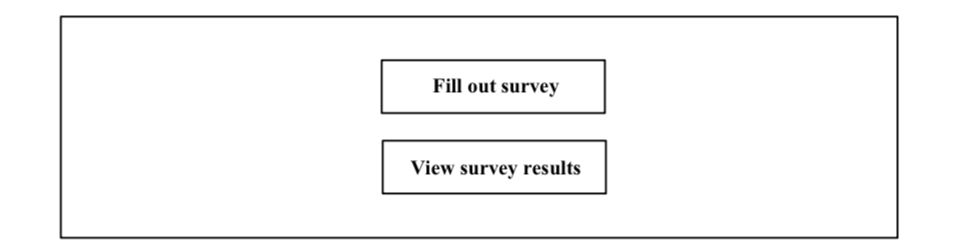
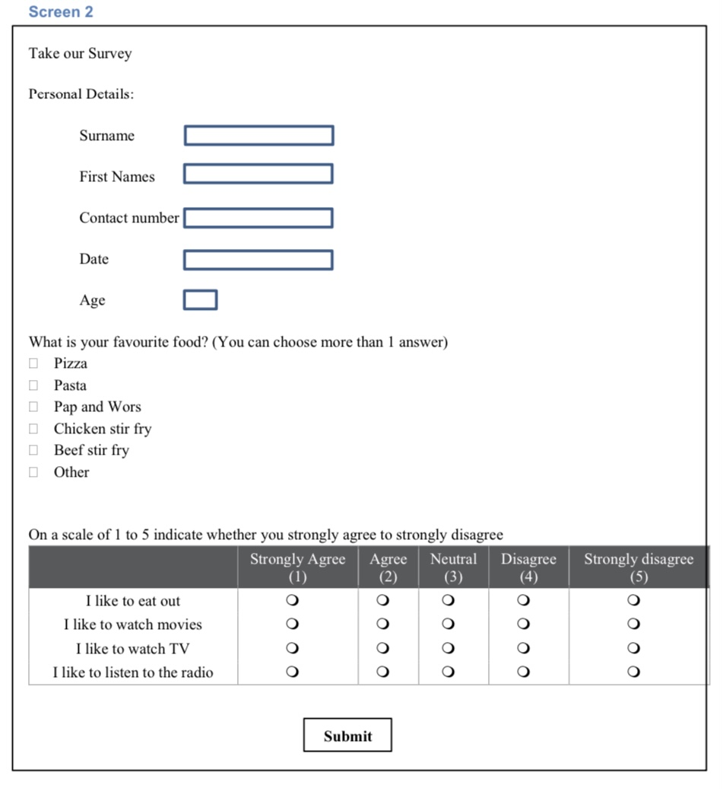
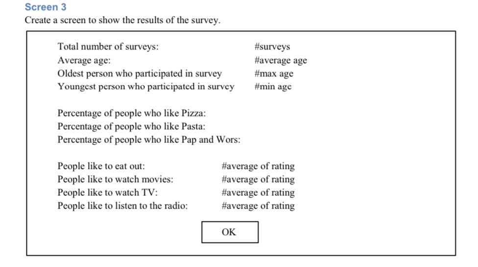

=======
## Survey Application

This is a web application that displays survey results, including total surveys, average age, oldest and youngest person, food preferences, and entertainment preferences. The application uses Node.js, Express.js, MongoDB, and HTML/CSS for the server, database, and frontend components.

# Installation

To run the Survey Results web application locally, please follow these steps:

# Clone the repository:
git clone <repository_url>

# Install the required dependencies by navigating to the project directory and running:
npm install

# Set up the MongoDB connection by providing your MongoDB database URL in the .env file located in the project's root directory:
MONGODB_URI=<your_mongodb_url>

# Start the server by running:
npm start

Access the web application by opening your browser and visiting http://localhost:3001.

## Code Structure

The code for the Survey Results web application is structured as follows:

server.js: The entry point of the application. Sets up the server, connects to the database, and defines the API routes.

models/dataModel.js: Defines the Mongoose schema and model for the survey data. The schema includes fields for the surname, name, contact, currentDate, age, favoriteFoods, and ratings.

public/index.html: The HTML file that displays the survey results. It includes JavaScript code to fetch data from the server and populate the values dynamically.

public/style.css: The CSS file that styles the HTML elements.

routes/api.js: Defines the API routes for fetching the survey data. It uses the DataModel to interact with the MongoDB database.
Survey Data Model

The survey data is stored in a MongoDB database using Mongoose. The DataModel defined in models/dataModel.js represents the data schema and provides an interface to interact with the data. The schema includes the following fields:

surname (String): The surname of the survey respondent.
name (String): The name of the survey respondent.
contact (String): The contact information of the survey respondent.
currentDate (Date): The date when the survey was submitted.
age (Number): The age of the survey respondent.
favoriteFoods (Array of Strings): The favorite foods of the survey respondent.
ratings (Object): The ratings for different entertainment preferences (eatOut, watchMovies, watchTV, listenToRadio).

## API Routes

The application provides the following API routes:

GET /api/survey-data: Retrieves the survey data from the database and returns it as JSON. This data is used to populate the survey results in the HTML file.

## Dependencies

The Survey Results web application uses the following major dependencies:

express: A minimal and flexible web application framework for Node.js.
mongoose: An Object Data Modeling (ODM) library for MongoDB and Node.js.
dotenv: A module to load environment variables from a .env file.

## Conclusion

The Survey Results web application provides an interface to view and analyze survey data. By following the installation instructions, you can set up the application locally and explore the survey results in your browser.

For any questions or issues, please contact Teddyvusimasina@gmail.com.
>>>>>>> origin/main

## INSPIRATION

# Test Assignment
The purpose of this assignment is to get the candidate to undertake a small project in the language of your choice that covers the basics of the following:-

1. Create a user interface where a person can enter data
2. Save the data that was entered into a database of your choice
3. Use the database to calculate/derive some values.
The application to be developed is one for collecting survey data about people’s lifestyle preferences. We would like you to create a desktop app, web app or mobile app that can be placed in a public space where people can fill out a survey. It is hoped that many people would fill out the survey so that we can analyse the data collected to make sense of it. You are welcome to get in touch with us to seek clarification on these requirements.

# Duration
You will have 1 week to complete assignment from the date you receive it.

# Deliverables
Upon completion of the assignment, you will be expected to meet with us so that you can do the following:-
 Do a demo of the app on your PC
 Be able to explain the architecture and design decisions.
 All source code to be made available for discussion. You will be asked to explain parts of your code.
 Share the completed project with us at internship@tshimologong.joburg through a git repository (such as GitHub, BitBucket, etc).

# Rules
1. You are required to undertake the work yourself.
2. You are permitted to use unlimited resources on the web.
3. As this application will never go into production, please disregard any concerns related to the
POPI act or any other legislation regarding the protection of personal information.
4. You are welcome to get in touch with us to seek clarification on these requirements.
5. Please note that the screens shown in this document are only meant to convey the ideas
(wireframes). The appearance of the screen will be determined by the environment in which you develop but you should be mindful of it being user-friendly.

# Specifications
The specifications for the application are now given.

# User Interface
For the user interface, there are 3 screens that need to be created.

# Screen 1
When the application starts up the user will be presented with a screen with the following two options.

Clicking on the first button will take the user to Screen 2. Clicking the second button will take the user to screen 3.

The personal details are just text boxes. The question about favourite food uses checkboxes. This will allow the user to select more than one. The last question about the rating uses radio buttons and will permit the user to choose only one. The selected response is converted to a number from 1 to 5.
When the user clicks on submit, the data must be written to a database of your choice. After that, the user must be returned to the main menu (Screen 1 discussed above).
In this way, many surveys can be done by users.

The expected calculations are as follows:-
 The Total number of surveys completed. This is just a count of the total number of rows in the
database.

 Average age of the people that participated in the survey

 Oldest person that participated in the survey

 Youngest person that participated in the survey.

 Percentage of people who like Pizza is calculated by the number of people that like Pizza divided
by the total number of surveys. Multiply by 100 to get the percentage. Present the result rounded
off to 1 decimal place.

 People like to eat out is calculated by working out the average of the rating. Present the result
rounded off to 1 decimal place.

When the user clicks on OK button the user must be returned to the main menu (Screen 1 discussed above).

# Optional

If you wish to challenge yourself you may explore the following options. These tasks should only be considered once all functionality above has been achieved.

 -Validate the fields. Check that the user has not left any of the text fields empty before they submit.

 -The user may NOT enter a value for Age that is less than 5 and should not be more than 120.

 -Ensure that the user has actually selected a rating for each of the four rating questions. They
cannot submit a survey without selecting a rating.

 -Styling the screens so that it looks modern and user-friendly.

 -Where the user is expected to enter the date, use a date picker.

